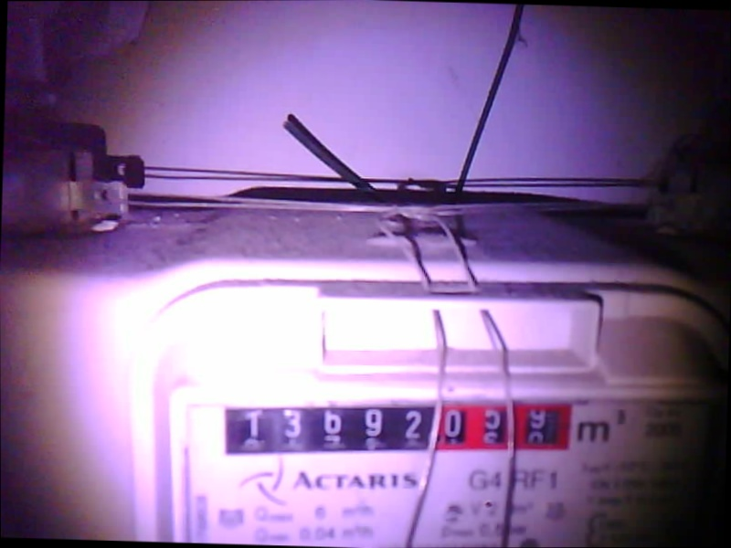

# smart-gas-meter-reader
This project utilizes an ESP-CAM to capture images of an analog gas meter. The camera communicates with a Linux server via the MQTT protocol. An MQTT broker and a client program run on the server, periodically instructing the camera to take a photo. On the server, a TensorFlow Lite object detector identifies the number plate's position in the image (bounding box), which is then cropped. The locations of the numbers are detected using an OpenCV script. The individual numbers are then classified by a simple CNN model.

## Labeling the dataset for object detection

[link to labeling tool](github.com/HumanSignal/labelImg)

## ESP-CAM installation:

## Steps of prediction:

1. ### Balancing
    If the image is tilted, the object detector marks a larger area. Therefore, it is important to balance the images.
    For this task, the Hough Lines algorithm is used.
    
2. ### Number plate detection
    The object detector is a TensorFlow Lite model trained in Colab.
    Model architecture is EfficientNetV4.
    https://colab.research.google.com/github/khanhlvg/tflite_raspberry_pi/blob/main/object_detection/Train_custom_model_tutorial.ipynb
    
3. ### Sharpening and resizing
    The detected images are resized to 140x1000 pixels.
    
4. ### Applying Adaptive threshold algorithm
5. ### Contour searching on threshold image
    The goal is to find the coordinates of the individual numbers on the number plate.
    Based on the found contours' coordinates, the 140x1000 px images are cut into 8 pieces.
    
6. ### Classify the image pieces
   
   
   
   A simple ad hoc TensorFlow CNN classifies the images into 10 classes. Due to the similarity of the problem, the dataset for model training was combined with the MNIST dataset.

## Results