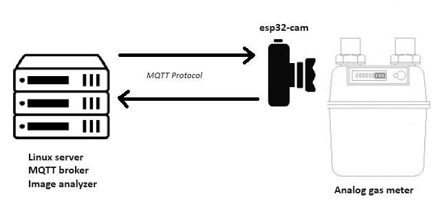
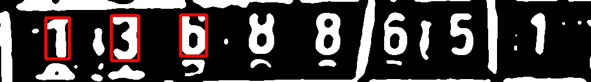

# Smart Gas Meter Reader

## Table of Contents
- [Introduction](#introduction)
- [Labeling the Dataset for Object Detection](#labeling-the-dataset-for-object-detection)
- [Programming the ESP32-CAM](#programming-the-esp32-cam)
- [Training the Object Detector](#training-the-object-detector)
- [Training the Image Classifier Model](#training-the-image-classifier-model)
- [ESP-CAM Installation](#esp-cam-installation)
- [Steps of Prediction](#steps-of-prediction)
  - [Balancing](#balancing)
  - [Dial-plate Detection](#dial-plate-detection)
  - [Sharpening and Resizing](#sharpening-and-resizing)
  - [Applying Adaptive Threshold Algorithm](#applying-adaptive-threshold-algorithm)
  - [Contour Searching on Threshold Image](#contour-searching-on-threshold-image)
  - [Classify the Image Pieces](#classify-the-image-pieces)
- [Results](#results)

## Labeling the dataset for object detection

# Possible name alternatives:
- Intelligent Gas Meter Monitor
- Automated Gas Meter Reader
- Smart Gas Consumption Tracker
- Digital Gas Meter Analyzer
- Gas Meter Vision System
- AI-Powered Gas Meter Reader
- Gas Usage Monitoring System
- Smart Metering Solution
- Gas Meter Image Processor
- Advanced Gas Meter Reader

This project utilizes an ESP-CAM to capture images of an analog gas meter. The camera communicates with a Linux server via the MQTT protocol. An MQTT broker and a client program run on the server, periodically instructing the camera to take a photo. On the server, a TensorFlow Lite object detector identifies the number plate's position in the image (bounding box), which is then cropped. The locations of the numbers are detected using an OpenCV script. The individual numbers are then classified by a simple CNN model.

## Programming the ESP32-CAM

1. **Install the Arduino IDE**: Download and install the Arduino IDE from the [official website](https://www.arduino.cc/en/software).

2. **Add the ESP32 Board to Arduino IDE**:
    - Open Arduino IDE.
    - Go to `File` > `Preferences`.
    - In the `Additional Board Manager URLs` field, add: `https://dl.espressif.com/dl/package_esp32_index.json`.
    - Go to `Tools` > `Board` > `Boards Manager`.
    - Search for `esp32` and install the `esp32` package.

3. **Connect the ESP32-CAM**:
    - Connect the ESP32-CAM to your computer using a USB-to-serial adapter.
    - Select the correct board and port in Arduino IDE: `Tools` > `Board` > `ESP32 Wrover Module` and `Tools` > `Port`.

4. **Upload the Code**:
    - Open the ESP32-CAM sketch from `File` > `Examples` > `ESP32` > `Camera` > `CameraWebServer`.
    - Modify the WiFi credentials in the sketch.
    - Upload the sketch to the ESP32-CAM.

5. **Test the Camera**:
    - Open the Serial Monitor to get the IP address of the ESP32-CAM.
    - Open a web browser and enter the IP address to see the camera feed.

## Training the Object Detector

1. **Set Up Google Colab**:
    - Open the [Model Maker Object Detection for Android Figurine](https://colab.research.google.com/github/khanhlvg/tflite_raspberry_pi/blob/main/object_detection/Train_custom_model_tutorial.ipynb) notebook in Google Colab.

2. **Prepare the Dataset**:
    - Label the dataset using the [labelImg](https://github.com/HumanSignal/labelImg) tool.
    - Upload the labeled dataset to Google Colab.

3. **Train the Model**:
    - Follow the steps in the Colab notebook to train the object detection model.
    - Download the trained TensorFlow Lite model.

4. **Compile for EdgeTPU**:
    - Use the EdgeTPU compiler to compile the model for EdgeTPU.
    - Download the compiled model to your local computer.

## Training the Image Classifier Model

1. **Prepare the Dataset**:
    - Combine the local dataset with the MNIST dataset.
    - Save the combined dataset.

2. **Train the Model**:
    - Use the `train/create_datasets.py` script to load and preprocess the dataset.
    - Train a simple CNN model using TensorFlow.

3. **Save the Model**:
    - Save the trained model in TensorFlow Lite format.

4. **Deploy the Model**:
    - Deploy the TensorFlow Lite model to the server for inference.

## ESP-CAM installation:

## Steps of prediction:

1. ### Balancing

    If the image is tilted, the object detector marks a bigger area. Therefor it is important to balance the images.
    For this task, Hugh lines algorithm is used.

  

2. ### Dial-plate detection
    The object detector is a tensorflow lite model trained in colab.
    Model architecture is EfficientNetV4.
    https://colab.research.google.com/github/khanhlvg/tflite_raspberry_pi/blob/main/object_detection/Train_custom_model_tutorial.ipynb

    

3. ### Sharpening and resizing 
    The detected images are resized to 140x1000 pixels.

    

4. ### Applying Adaptive threshold algorithm 
5. ### Contour searching on threshold image
    The aim is to find the coordinates of the individual numbers on the numberplate.
    On the basis of the found contours' coordinates, the 140x1000 px images are cut into 8 pieces

    

6. ### Classify the image pieces

    
    
    

   A simple ad hoc tensorflow CNN classifies the images into 10 classes. Because of the similarity of the problem, for the model training the dataset was combined with MNIST dataet.

## Results

# smart-gas-meter-reader

