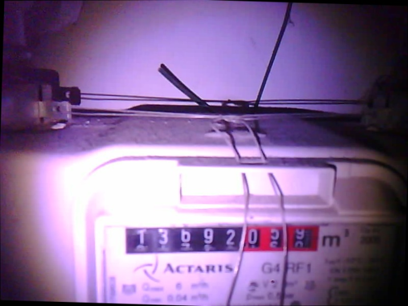
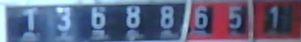
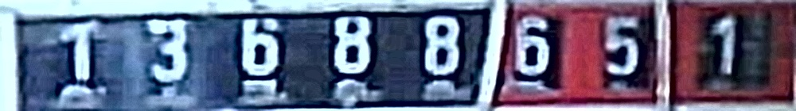
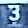

# smart-gas-meter-reader
This project applies an esp-cam to take photos of an analog gas meter. The camera and a linux server communicate via mqtt protocol. An mqtt broker and a client program runs on the server wich periodically sends a message to the camera to take a photo. On the server, a .tflite object detector detects the numberplate's position on the image (bounding box), which will be cut out. The locations of the numbers are detected by an opencv script. The individual numbers are the input of a simple CNN model that classifies the numbers.

## Labeling the dataset for object detection

[link to labeling tool](github.com/HumanSignal/labelImg)

## Esp-Cam installation:

## Steps of prediction:

1. ### Balancing
    If the image is tilted, the object detector marks a bigger area. Therefor it is important to balance the images.
    For this task, Hugh lines algorithm is used.
    
2. ### Numberplate detection
    The object detector is a tensorflow lite model trained in colab.
    Model architecture is EfficientNetV4.
    https://colab.research.google.com/github/khanhlvg/tflite_raspberry_pi/blob/main/object_detection/Train_custom_model_tutorial.ipynb
    
3. ### Sharpening and resizing 
    The detected images are resized to 140x1000 pixels.
    
4. ### Applying Adaptive threshold algorithm 
5. ### Contour searching on threshold image
    The aim is to find the coordinates of the individual numbers on the numberplate.
    On the basis of the found contours' coordinates, the 140x1000 px images are cut into 8 pieces 
    
6. ### Classify the image pieces
   
   
   
   A simple ad hoc tensorflow CNN classifies the images into 10 classes. Because of the similarity of the problem, for the model training the dataset was combined with MNIST dataet.

## Results
