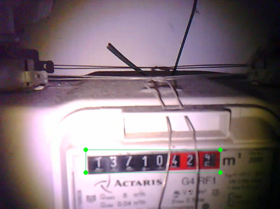
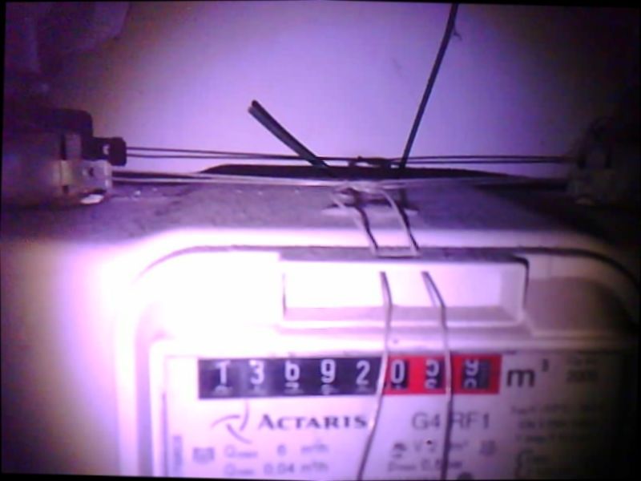
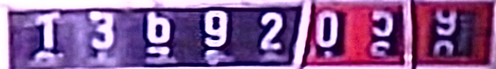
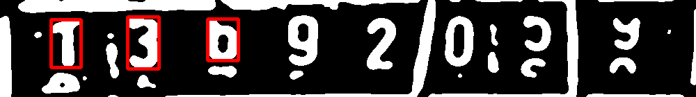
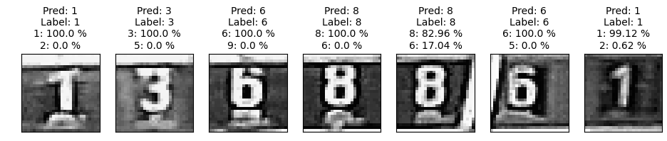
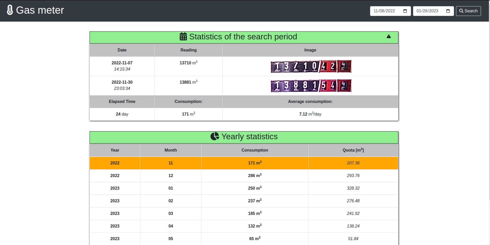

# Smart Gas Meter Reader

Python 3.9.12

```commandline
pip install -r requirements.txt
```


## Table of Contents
- [Overview](#Overview)
- [Programming the ESP32-CAM](#programming-the-esp32-cam)
- [Setting up the server](#setting-up-the-server)
- [Creating training datasets for the models](#Creating-training-datasets-for-the-models)
- [Training the Object Detector](#training-the-object-detector)
- [Training the Image Classifier Model](#training-the-image-classifier-model)
- [Steps of Prediction](#steps-of-prediction)
  - [Balancing](#balancing)
  - [Dial-plate Detection](#dial-plate-detection)
  - [Sharpening and Resizing](#sharpening-and-resizing)
  - [Applying Adaptive Threshold Algorithm](#applying-adaptive-threshold-algorithm)
  - [Contour Searching on Threshold Image](#contour-searching-on-threshold-image)
  - [Classify the Image Pieces](#classify-the-image-pieces)
- [Results](#results)


## Overview


- The ESP-CAM captures images of an analog gas meter.
- The camera communicates with a Linux server via MQTT.
  - The server runs an MQTT broker and a client program.
  - The server instructs the camera to take a photo.
  - The camera sends the photo to the server.
- The server processes the image
  - OpenCV is used to preprocess the image.
  - `TensorFlow Lite model` detects the dial plate's location.
  - The dial plate is cut into 8 pieces.
  - A `simple CNN model` classifies each piece.


## Programming the ESP32-CAM
 [Esp32-cam setup readme](./setup/setup_esp32_cam/README.md)

## Setting up the server
 [Mosquitto setup readme](setup/setup_server/README.md)

## Creating training datasets for the models

1. Object Detection (Tensorflow Lite - EfficientDet)
    - The dataset is labeled using the [labelImg](https://github.com/HumanSignal/labelImg) tool.
   <p align="center">
        
   </p>

2. Image Classification (Tensorflow - CNN)
    - The images (  ) have to be sorted into folders, where each folder represents a class. The dataset may be combined with the MNIST dataset to increase the number of training samples.
    - The folder structure:
      ```commandline
      ├── 0
      │   ├── 0_1.jpg
      │   ├── 0_2.jpg
      │   ├── ...
      ├── ...
      ├── 9
      │   ├── 9_1.jpg
      │   ├── 9_2.jpg
      │   ├── ...
      ```

## Training the Object Detector

1. **Set Up Google Colab**:
    - Open the [Model Maker Object Detection for Android Figurine](https://colab.research.google.com/github/khanhlvg/tflite_raspberry_pi/blob/main/object_detection/Train_custom_model_tutorial.ipynb) notebook in Google Colab.

2. **Prepare the Dataset**:
    - Upload the labeled dataset to Google Colab.

3. **Train the Model**:
    - Follow the steps in the Colab notebook to train the object detection model.
    - Download the trained TensorFlow Lite model.

## Training the Image Classifier Model

Use the `train/number_classification/train_and_eval.ipynb` notebook to train the model.

## Steps of prediction:

1. ### Balancing

    If the image is tilted, the object detector marks a bigger area. Therefor it is important to balance the images.
    For this task, Hugh lines algorithm is used.

<p align="center">
  
</p>

2. ### Dial-plate detection

<p align="center">
    
</p>

3. ### Sharpening and resizing 
    The detected images are resized to 140x1000 pixels.

<p align="center">
    
</p>

4. ### Applying Adaptive threshold algorithm 

<p align="center">
    
</p>

5. ### Contour searching on threshold image
    The aim is to find the coordinates of the individual numbers on the numberplate.
    On the basis of the found contours' coordinates, the 140x1000 px images are cut into 8 pieces

<p align="center">
    
</p>

6. ### Classify the image pieces

   A tensorflow CNN model classifies the images into 10 classes.
<p align="center">
    
</p>

7. ### Results
    The sharpened image of the dial plate is saved in the `/results` folder with the filename constructed from a `sequential number`, the `predictions` and the `timestamp`.
   <br> Pattern: `<seq_num>_<first_5_nums>_<last_3_nums>_<timestamp>.jpg` <br>
   Example: `8_13678_902_1668970881.jpg`


## Results in flask web app

The images from the results folder are copied to the flask app's static/images folder. The images are displayed on the web page.

<p align="center">
    
</p>


