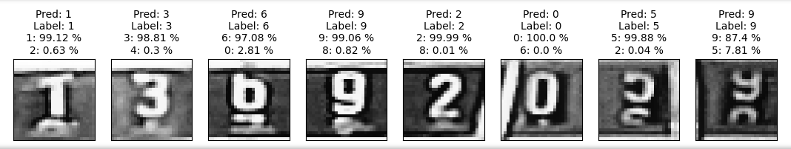

# Smart Gas Meter Reader

Python 3.9.12

```commandline
pip install -r requirements.txt
```


## Table of Contents
- [Overview](#Overview)
- [Labeling the Dataset for Object Detection](#labeling-the-dataset-for-object-detection)
- [Programming the ESP32-CAM](#programming-the-esp32-cam)
- [Training the Object Detector](#training-the-object-detector)
- [Training the Image Classifier Model](#training-the-image-classifier-model)
- [Steps of Prediction](#steps-of-prediction)
  - [Balancing](#balancing)
  - [Dial-plate Detection](#dial-plate-detection)
  - [Sharpening and Resizing](#sharpening-and-resizing)
  - [Applying Adaptive Threshold Algorithm](#applying-adaptive-threshold-algorithm)
  - [Contour Searching on Threshold Image](#contour-searching-on-threshold-image)
  - [Classify the Image Pieces](#classify-the-image-pieces)
- [Results](#results)


## Overview


- The ESP-CAM captures images of an analog gas meter.
- The camera communicates with a Linux server via MQTT.
  - The server runs an MQTT broker and a client program.
  - The server instructs the camera to take a photo.
  - The camera sends the photo to the server.
- The server processes the image
  - OpenCV is used to preprocess the image.
  - `TensorFlow Lite model` detects the dial plate's location.
  - The dial plate is cut into 8 pieces.
  - A `simple CNN model` classifies each piece.

## Labeling the training datasets

1. Object Detection (Tensorflow Lite - EfficientDet)
    - The dataset is labeled using the [labelImg](https://github.com/HumanSignal/labelImg) tool.
   <p align="center">
        
   </p>

2. Image Classification (Tensorflow - CNN)
    - The images (  ) have to be sorted into folders, where each folder represents a class. The dataset is combined with the MNIST dataset to increase the number of training samples.
    - The folder structure:
      ```commandline
      ├── 0
      │   ├── 0_1.jpg
      │   ├── 0_2.jpg
      │   ├── ...
      ├── ...
      ├── 9
      │   ├── 9_1.jpg
      │   ├── 9_2.jpg
      │   ├── ...
      ```

## Programming the ESP32-CAM

 [Esp32-cam setup readme](./setup/setup_esp32_cam/README.md)


## Training the Object Detector

1. **Set Up Google Colab**:
    - Open the [Model Maker Object Detection for Android Figurine](https://colab.research.google.com/github/khanhlvg/tflite_raspberry_pi/blob/main/object_detection/Train_custom_model_tutorial.ipynb) notebook in Google Colab.

2. **Prepare the Dataset**:
    - Label the dataset using the [labelImg](https://github.com/HumanSignal/labelImg) tool.
    - Upload the labeled dataset to Google Colab.

3. **Train the Model**:
    - Follow the steps in the Colab notebook to train the object detection model.
    - Download the trained TensorFlow Lite model.

4. **Compile for EdgeTPU**:
    - Use the EdgeTPU compiler to compile the model for EdgeTPU.
    - Download the compiled model to your local computer.

## Training the Image Classifier Model

1. **Prepare the Dataset**:
    - Combine the local dataset with the MNIST dataset.
    - Save the combined dataset.

2. **Train the Model**:
    - Use the `train/create_datasets.py` script to load and preprocess the dataset.
    - Train a simple CNN model using TensorFlow.

3. **Save the Model**:
    - Save the trained model in TensorFlow Lite format.

4. **Deploy the Model**:
    - Deploy the TensorFlow Lite model to the server for inference.


## ESP-CAM installation:

## Steps of prediction:

1. ### Balancing

    If the image is tilted, the object detector marks a bigger area. Therefor it is important to balance the images.
    For this task, Hugh lines algorithm is used.

<p align="center">
  
</p>

2. ### Dial-plate detection
    The object detector is a tensorflow lite model trained in colab.
    Model architecture is EfficientNetV4.
    https://colab.research.google.com/github/khanhlvg/tflite_raspberry_pi/blob/main/object_detection/Train_custom_model_tutorial.ipynb

<p align="center">
    
</p>

3. ### Sharpening and resizing 
    The detected images are resized to 140x1000 pixels.

<p align="center">
    
</p>

4. ### Applying Adaptive threshold algorithm 
5. ### Contour searching on threshold image
    The aim is to find the coordinates of the individual numbers on the numberplate.
    On the basis of the found contours' coordinates, the 140x1000 px images are cut into 8 pieces

<p align="center">
    
</p>

6. ### Classify the image pieces

   A simple ad hoc tensorflow CNN classifies the images into 10 classes. Because of the similarity of the problem, for the model training the dataset was combined with MNIST dataet.
<p align="center">
    
</p>

## Results

# smart-gas-meter-reader


# Set up mosquitto MQTT broker
```
sudo apt-get install mosquitto mosquitto-clients
```

# Set up static IP address
```
sudo nano /etc/dhcpcd.conf
```
Add the following lines to the end of the file
```
interface wlan0
static ip_address=
static routers=
static domain_name_servers=
```

