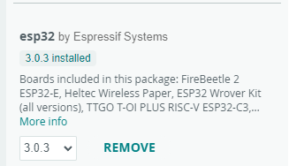
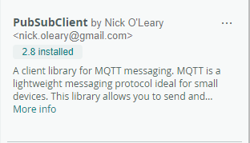
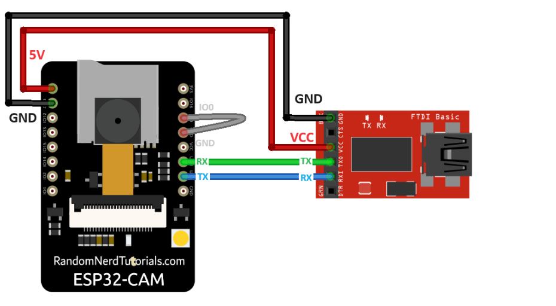

## Programming the ESP32-CAM

1. **Install the Arduino IDE**: Download and install the Arduino IDE from the [official website](https://www.arduino.cc/en/software).

2. **Add the ESP32 Board to Arduino IDE**:
    - Open Arduino IDE.
    - Go to `Tools` > `Board` > `Boards Manager`.
    - Install the `esp32 by Espressif Systems`.
    - Search for `esp32` and install the `esp32` package.
    - 
  

3. **Add `PubSubClient by Nock O'Leary` **:
    - Go to `Tools` > `Manage Libraries...`.
    - Search for `PubSubClient` and install the library.
    - 
  

4. **Connect the ESP32-CAM**:
    - Connect the ESP32-CAM to your computer using a USB-to-serial adapter.
    - 
  

    - Select the correct board and port in Arduino IDE: `Tools` > `Board` > `AI Thinker ESP32-CAM` and `Tools` > `Port`.

5. **Upload the Code**:
    - In `esp32_cam_mqtt.ino` sketch file, update the `WIFI_SSID`, `WIFI_PASSWORD`, `MQTT_BROKER`, `MQTT_PORT`, `MQTT_USERNAME`, and `MQTT_PASSWORD` with your Wi-Fi and MQTT broker details. 
    - Upload the sketch to the ESP32-CAM.

   